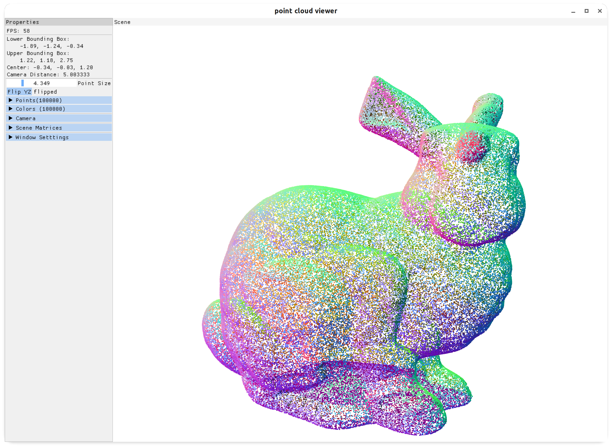

# Point Cloud Viewer

Simple OpenGL program to visualize point cloud.

The input data files should be **plain text** files.



```
USAGE: point_cloud_viewer [OPTIONS] point_cloud 

OPTIONS:
    -n, --normals <normals>
    -c, --colors <colors>
    -h, --help <help>
    -v, --version <version>

ARGS:
    point_cloud  
```

examples usage:

```shell
point_cloud_viewer --normals bunny100k.normals bunny100k.xyz
```

dependencies:

- glad: OpenGL loader
- GLFW: window manager
- imgui: GUI library
- spdlog: debug log
- structopt: parse command line arguments