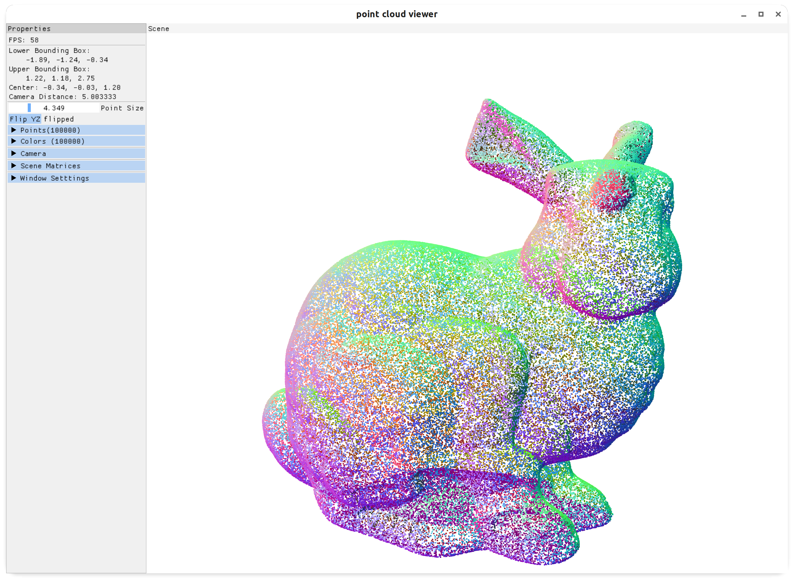
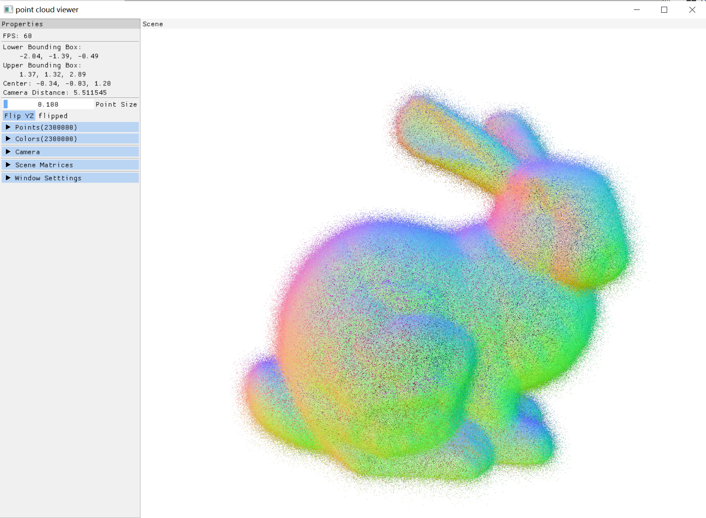

# Point Cloud Viewer

Simple OpenGL program to visualize point cloud.

The input data files should be **plain text** files.

screenshot on Linux:



screenshot on Windows 10:
2,300,000 points(GTX 1650)


```bash
USAGE: point_cloud_viewer [OPTIONS] point_cloud 

OPTIONS:
    -n, --normals <normals>
    -c, --colors <colors>
    -h, --help <help>
    -v, --version <version>

ARGS:
    point_cloud  
```

examples usage:

```shell
point_cloud_viewer --normals bunny100k.normals bunny100k.xyz
```

dependencies:

- glad: OpenGL loader
- GLFW: window manager
- imgui: GUI library
- spdlog: debug log
- structopt: parse command line arguments

# Building and installing

See the [BUILDING](BUILDING.md) document.

# Contributing

See the [CONTRIBUTING](CONTRIBUTING.md) document.

# Licensing

<!--
Please go to https://choosealicense.com/licenses/ and choose a license that
fits your needs. The recommended license for a project of this type is the
GNU AGPLv3.
-->

MIT License

Copyright (c) 2022 anke tang

Permission is hereby granted, free of charge, to any person obtaining a copy
of this software and associated documentation files (the "Software"), to deal
in the Software without restriction, including without limitation the rights
to use, copy, modify, merge, publish, distribute, sublicense, and/or sell
copies of the Software, and to permit persons to whom the Software is
furnished to do so, subject to the following conditions:

The above copyright notice and this permission notice shall be included in all
copies or substantial portions of the Software.

THE SOFTWARE IS PROVIDED "AS IS", WITHOUT WARRANTY OF ANY KIND, EXPRESS OR
IMPLIED, INCLUDING BUT NOT LIMITED TO THE WARRANTIES OF MERCHANTABILITY,
FITNESS FOR A PARTICULAR PURPOSE AND NONINFRINGEMENT. IN NO EVENT SHALL THE
AUTHORS OR COPYRIGHT HOLDERS BE LIABLE FOR ANY CLAIM, DAMAGES OR OTHER
LIABILITY, WHETHER IN AN ACTION OF CONTRACT, TORT OR OTHERWISE, ARISING FROM,
OUT OF OR IN CONNECTION WITH THE SOFTWARE OR THE USE OR OTHER DEALINGS IN THE
SOFTWARE.
